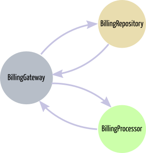

# PhoneBilling

The PhoneBilling project is intended for telephone bill creation. In order to do it so, the system provides a way to persist calls, which enables the bill calculation for an specific period.

The PhoneBilling architecture is divided in three applications: BillingGateway, BillingProcessor and BillingRepository.

The apps separation is for maintenance flexibility and project improviment, making it easier to make changes, i.g., replacing Postgres to MongoDB, changing the API for something else or just change the validators inside BillingProcessor.



## BillingGateway

A Phoenix application for process requests to the PhoneBilling REST API. It its responsibility the coordination of database access and business rules execution.

The BillingGateway is based on the application layer of Domain Driven Design (DDD) and it is the dependency injector of the domain layer.

## BillingProcessor

An Elixir application that represents the domain layer of DDD. It was thought to be self-contained, completely agnostic. In others words, it has no depencies, e.g., database, file IO or network communication.

It contains all the business rules to process calls and create bills.

## BillingRepository

An Elixir application with the purpose of persist to and recover from database the telephone calls data. It is the infrastructure layer of Domain Driven Design.

## Installing and testing instructions

### Dependencies

* Erlang 21
* Elixir 1.7.3
* Phoenix 1.3.4
* PostgreSQL 9.6.10

### Installing

Follow the steps bellow to run the server locally

1. `$ git clone https://github.com/danielfoxp2/phone_billing.git`
2. `$ cd phone_billing`
3. `$ mix deps.get`
4. `$ mix ecto.create`
5. `$ mix ecto.migrate`
6. `$ mix phx.server`

Then you can make calls to the api as shown in the example bellow

```bash
$ curl localhost:4000/api/taxes \
  -H "Content-Type: application/json" \
  -d '{"taxes_params": { "reference_period": "01/2019", "call_charge": "0.05", "standing_charge": "0.09" }}' 
```

For more information about how to use the api check the [documentation](./api_documentation.md) 

### Running Tests

#### Acceptance 

In the root directory of umbrella

`$ mix test test/acceptance_behavior/save_call_details_record_feature.exs`
`$ mix test test/acceptance_behavior/calculate_bill_feature.exs`

#### Integration

`$ cd apps/billing_repository`
`$ mix test`

#### Unit

`$ cd apps/billing_processor`
`$ mix test`

### Generating docs

It was used Exdoc to export the docs as HTML. To generate the docs in the umbrella root folder run the following:

`$ mix docs`

Then Exdoc will create a doc folder in the umbrella root folder with all docs created. Open with your browser the index.html that is the docs entrypoint.

The most important links in the docs are the **PhoneBilling** (readme.html), and the **PhoneBilling API Documentation** (api_documentation.html).

## Environment used to run this project

### Computer

* Dell Inspirion 14R 5437-A20, 8GB, Intel Core I7.
* Linux Ubuntu 16.04.
* Visual Studio Code with vscode-elixir plugin.
* DBeaver 5.3.4
* Heroku CLI 7.16.6

## Side notes

The applications billing_gateway and billing_repository were fully documented but the billing_processor has only some modules documented. This was done on purpose.

It was done this way to provide an example of a code without formal documentation that uses the specification (tests), modules interfaces and functions implementations as its own documentation, following the self-documented code practice.


